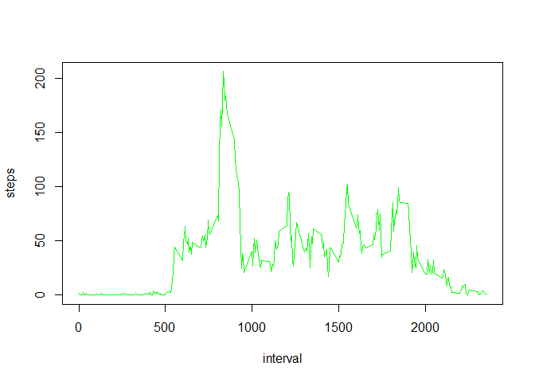

# Loading and preprocessing the data
Download, unzip and read the data:

```r
url <- "https://d396qusza40orc.cloudfront.net/repdata%2Fdata%2Factivity.zip"
download.file(url, destfile = "activity.zip")
unzip("activity.zip")
data <- read.csv("activity.csv", skipNul = T, row.names=NULL)

#Transform the date column into a real date: 
library(lubridate)
```

```
## 
## Attaching package: 'lubridate'
```

```
## The following object is masked from 'package:base':
## 
##     date
```

```r
data$date <- ymd(data$date)
```


#What is the mean total number of steps taken per day?


```r
library(dplyr)
```

```
## 
## Attaching package: 'dplyr'
```

```
## The following objects are masked from 'package:lubridate':
## 
##     intersect, setdiff, union
```

```
## The following objects are masked from 'package:stats':
## 
##     filter, lag
```

```
## The following objects are masked from 'package:base':
## 
##     intersect, setdiff, setequal, union
```

```r
datadays <- data
datadays <- arrange(datadays, date)
datadays <- group_by(datadays, date)
datadays <- summarize(datadays, steps = sum(steps))
datadays <- subset(datadays, complete.cases(datadays))
```

I tried to do this with a pipeline, but I could not get this to work:   
datadays %>% data %>%  
        arrange(date) %>%  
        group_by(date) %>%  
        summarize(steps = sum(steps)) %>%  
        subset(complete.cases(datadays))  
        
## Histogram of the total number of steps taken each day

```r
hist(datadays$steps, main = "Total number of steps taken each day", 
     xlab = "number of steps/day", col = "yellow")
```

<!-- -->

## Mean and median number of steps taken each day

```r
options(scipen = 999) #to avoid scientific notation
mean <- round(mean(datadays$steps), digits = 0)
median <- round(median(datadays$steps), digits = 0)
```

The mean is 10766 and the median is 10765.  

#What is de average daily activity pattern?

Below, the mean number of steps is calculated for each interval number. 

```r
library(dplyr)
datainterval <- data
datainterval <- arrange(datainterval, interval)
datainterval <- group_by(datainterval, interval)
datainterval <- subset(datainterval, complete.cases(datainterval))
datainterval <- summarize(datainterval, steps = mean(steps))
```

##Time series plot of the average number of steps taken


```r
plot(datainterval, type = "l", col = "green")
```

<!-- -->

##The 5-minute interval that, on average, contains the maximum number of steps

Interval number 835 contains 206 steps (on average).

```r
print(subset(datainterval, steps == max(steps)))
```

```
## # A tibble: 1 x 2
##   interval    steps
##      <int>    <dbl>
## 1      835 206.1698
```

#Imputing missing values
The total number of rows with NAs is 2304. 

```r
table(complete.cases(data))
```

```
## 
## FALSE  TRUE 
##  2304 15264
```

##Code to describe and show a strategy for imputing missing data


```r
names(datainterval) <- c("interval", "meansteps")
dataNew = merge(data, datainterval, by.y = "interval")
dataNew <- mutate(dataNew, imputedsteps = 
                      ifelse(is.na(steps), meansteps, steps))
dataNew <- dataNew[, c(5,3,1)]
names(dataNew) <- c("steps", "date", "interval")
```

##Histogram of the total number of steps taken each day after missing values are imputed


```r
library(dplyr)
datadays <- dataNew
datadays <- arrange(datadays, date)
datadays <- group_by(datadays, date)
datadays <- summarize(datadays, steps = sum(steps))
datadays <- subset(datadays, complete.cases(datadays))

hist(datadays$steps, main = "Total number of steps (imputed) taken each day", 
     xlab = "number of steps/day", col = "purple")
```

<!-- -->


```r
options(scipen = 999) #to avoid scientific notation
mean <- round(mean(datadays$steps), digits = 0)
median <- round(median(datadays$steps), digits = 0)
```

The new mean is 10766 and the new median is 10766. Both are now the same as the mean that ignored the missing values. The influence is very small: only 1 step... 

##Are there any differences in activity patterns between weekdays and weekends?

Panel plot comparing the average number of steps taken per 5 minute interval across weekdays and weekends


```r
#create a new variable 'day' 
#with the dutch words for saturday and sunday
dataNew <- mutate(dataNew, day = 
                          ifelse(weekdays(date)=="zaterdag", "weekend",
                          ifelse(weekdays(date)=="zondag","weekend", 
                                 "weekday")))
#convert it to a factor variable
dataNew$day <- as.factor(dataNew$day)

#sort and group the data
dataNew <- arrange(dataNew, interval)
dataNew <- group_by(dataNew, interval)

#calculate mean per interval on weekdays
dataWkdy <- dataNew
dataWkdy <- subset(dataWkdy, day == "weekday")
dataWkdy <- summarize(dataWkdy, steps = mean(steps))
dataWkdy <- mutate(dataWkdy, day = "weekday")

#calculate mean per interval in the weekend
dataWknd <- dataNew
dataWknd <- subset(dataWknd, day == "weekend")
dataWknd <- summarize(dataWknd, steps = mean(steps))
dataWknd <- mutate(dataWknd, day = "weekend")

dataWk <- rbind(dataWkdy, dataWknd)

#make the plots
library(lattice)
xyplot(steps ~ interval | day, dataWk, type = "l", layout = c(1,2))
```

<!-- -->
